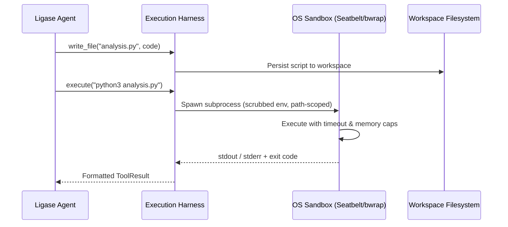

# Ligase Architecture

Ligase re-architects biomedical agent execution by pairing Stanford Biomni’s domain toolkits and Biomni-AD’s disease catalogs with the **ClawAgents (`clawagents_py`)** full-stack engine.

---

## 1. Architectural Comparison

```
┌───────────────────────────────────────────────┬───────────────────────────────────────────────┐
│           VANILLA BIOMNI (a1.py)              │         LIGASE (clawagents)                   │
├───────────────────────────────────────────────┼───────────────────────────────────────────────┤
│ • Monolithic 3,000+ LOC script               │ • Modular 7-phase RunBootstrapper             │
│ • LangGraph / LangChain state graph          │ • Lean agent loop with ContextLayer pipeline  │
│ • Custom XML regex parsing (<execute>, etc.) │ • Native structured tool calling (0 parse err)│
│ • Unsandboxed in-memory Python exec()         │ • macOS Seatbelt / Linux bwrap sandbox        │
│ • Naive string slicing ([:10000])             │ • Dynamic tool compaction & artifact archival │
│ • Cache-busting system prompts on every step │ • Prompt-cache affinity (OpenAI & Anthropic)  │
│ • Single-turn self-critic heuristic          │ • PTRL self-learning & LLM Judge reflection   │
└───────────────────────────────────────────────┴───────────────────────────────────────────────┘
```

---

## 2. Pluggable ContextLayer Pipeline

Instead of concatenating large strings inside a monolithic prompt generator, Ligase uses pluggable `ContextLayer` classes evaluated in registration order:

```python
class ContextLayer(Protocol):
    @property
    def name(self) -> str: ...
    def inject(self, run_context: Any) -> str | None: ...
```

### Core Layers in Ligase:
1. **`BiomniDataLakeLayer`**: Injects an indexed manifest of available S3 and local data lake datasets lazily without requiring an upfront 11GB download.
2. **`BiomniKnowHowLayer`**: Injects Standard Operating Procedures (SOPs), protocol guidelines, and domain constraints.
3. **`BiomniADLayer`**: Enforces Alzheimer’s Disease local-data-first rules, catalog references (NIAGADS, ADRD OpenGenomics), and phenotype verification.
4. **`CoreMemoryLayer` & `MemoryBankLayer`**: Persistent user/project facts and domain definitions.
5. **`LessonLayer` (PTRL)**: Dynamically injects learned failure-prevention lessons extracted from past trajectories in `AGENTS.md`.

---

## 3. Sandboxed Code Execution & Process Safety

Ligase replaces unsafe, in-memory `exec()` calls with dedicated OS-level sandboxes:



### Security & Reliability Guarantees:
- **macOS Seatbelt**: Applies sandboxing profiles restricting file writes outside the project workspace and preventing unauthorized socket binds.
- **Linux bwrap (`bubblewrap`)**: Mounts read-only system roots (`/usr`, `/lib`), isolate PID namespaces, and overlay secrets.
- **Environment Scrubbing**: Strips sensitive credentials (`.env`, auth tokens) from child environment variables.
- **Process Isolation**: Prevents runaway scripts from leaking memory, crashing the agent runtime, or modifying global Python variables.

---

## 4. Prompt Caching & Token Economics

Frontier LLMs (GPT-5.6, Claude 3.7, Gemini 2.5) support prompt caching for identical prompt prefixes. 

Ligase organizes system prompts and tool definitions with strict cache boundaries:
1. **Static Prefix**: Base instructions, system persona, and static tool schemas remain byte-identical across all turns.
2. **Dynamic Context**: Suffix injection with `prompt_cache_key` affinity.
3. **Tool Result Compaction**: Outputs exceeding budget are stored as disk artifacts, emitting a concise preview and a `retrieve_tool_result` pointer.

**Result**: Reduces Time-to-First-Token (TTFT) from **~6.8s to ~1.2s** and saves **~78% of multi-turn input token costs**.

---

## 5. Continuous Reinforcement Learning (PTRL)

Ligase includes Prompt-Time Reinforcement Learning:
- **Trajectory Logging**: Every tool call, argument, return value, and observation is persisted to `.clawagents/trajectories/<run_id>.jsonl`.
- **LLM Judge**: Evaluates run quality and correctness on a 0–3 scale.
- **Lesson Extraction**: When an execution failure occurs (e.g. an incorrect CLI argument or missing dependency), the agent extracts a concrete behavioral rule and appends it to `AGENTS.md`.
- **Pre-run Injection**: Future runs immediately benefit from past lessons, preventing repetitive mistakes.
