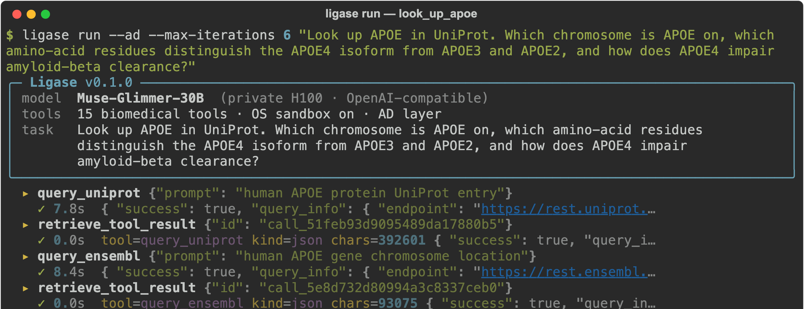
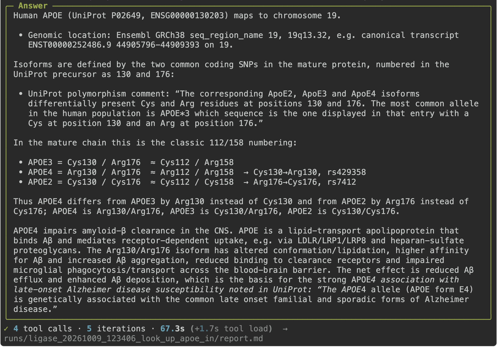
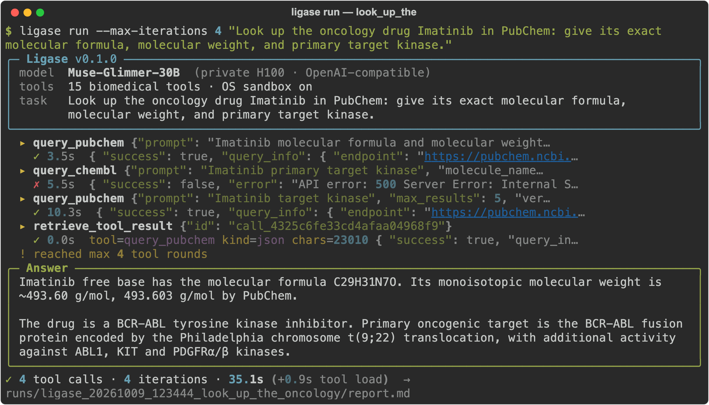
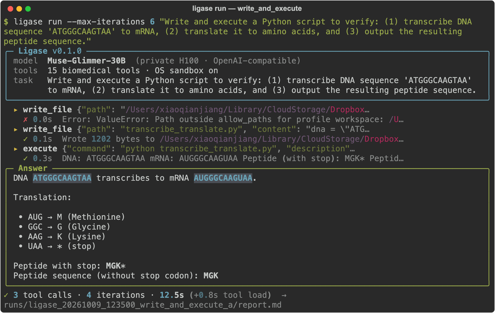

# Ligase

**A local-first biomedical research agent.** Ask a question in plain language; Ligase picks the right community tools (UniProt, Ensembl, PubChem, GWAS Catalog, Open Targets, ClinVar, …), runs any code in an OS sandbox, and hands back a sourced answer plus a report of every step.

DNA ligase joins fragments into one strand. Ligase joins open-source tools, the model of your choice (a private model on one GPU, a laptop model, or a frontier API), and your data into one workflow.

```bash
./install.sh                 # once
ligase example apoe4         # a ready-made Alzheimer's genetics study
ligase                       # ask your own questions
```

---

## Why Ligase

| | Original Biomni agent | **Ligase + Muse Glimmer 30B** |
|---|---:|---:|
| Mean time per task (5-task suite) | 40.5 s | **8.2 s (4.9× faster)** |
| Keyword accuracy | 95% | **95%** |
| Alzheimer's APOE4 task | 129.5 s | **6.0 s (21.6× faster)** |
| Runs on | frontier API | **one private H100**, or any API |
| Code execution | in-process `exec()` | **OS sandbox** (macOS Seatbelt / Linux bwrap) |

Same model, different agent layer: on Muse Glimmer 30B, Ligase's compact harness cut mean latency from 71.0 s to 8.2 s and raised accuracy from 48% to 95%. Details and raw results: [benchmarks/BENCHMARK.md](benchmarks/BENCHMARK.md).

---

## Quickstart

**1. Install** (macOS or Linux, Python ≥ 3.10, git; uses `uv` if present)

```bash
git clone https://github.com/x1jiang/ligase.git
cd ligase
./install.sh
```

The installer fetches the open-source tool library, builds `.venv`, creates `.env`, and runs a health check. Add `--genomics` for the heavy single-cell/protein stack (torch, ESM, scanpy).

**2. Pick a model** in `.env` (set one):

```env
GLIMMER_30B_BACKEND=http://<host>:<port>/v1   # private OpenAI-compatible model (Muse Glimmer, vLLM, SGLang)
OPENAI_API_KEY=sk-...                         # or OpenAI
```

**3. Check and run**

```bash
source .venv/bin/activate
ligase doctor                # every row should say ok
ligase example apoe4
```

---

## Commands

| Command | What it does |
|---|---|
| `ligase` | Interactive prompt: type questions, `examples`, `exit` |
| `ligase run "<question>"` | One study; prints tool calls live and the answer |
| `ligase examples` | List ready-made studies |
| `ligase example <name>` | Run one: `apoe4`, `imatinib`, `dna` |
| `ligase doctor` | Check install, tools, model endpoint, sandbox |

Useful flags: `--model auto|glimmer|openai|gemma|custom` (default `auto`: private host if set, else OpenAI), `--ad` (Alzheimer's context), `--max-iterations N`, `--out DIR`, `--record session.svg`.

Every run writes `runs/ligase_<time>_<slug>/report.md` with the question, model, timing, tool trace and answer.

---

## What a study looks like

**APOE4 (Alzheimer's genetics).** `ligase example apoe4` queries UniProt and Ensembl, then answers with chromosome 19q13.32 and the Arg112/Arg158 residues that define APOE4, quoting UniProt.




**Imatinib (drug lookup).** PubChem gives C29H31N7O and 493.6 g/mol; when ChEMBL's API returned HTTP 500, the agent fell back instead of stalling.



**DNA translation (sandboxed code).** The sandbox refuses a write outside the workspace; the agent retries inside it, runs the script, and returns `MGK`.



Recorded October 9, 2026 on Muse Glimmer 30B (private H100).

---

## Python API

```python
from ligase import create_agent

agent = create_agent(
    model="gpt-5.6-luna",            # or a private model with base_url="http://<host>/v1"
    modules=["database", "pharmacology", "biochemistry"],
    is_ad_specialized=True,          # Alzheimer's context layer
)
print(agent.go("Which residues distinguish APOE4 from APOE3?"))
```

---

## How it works

```
question ─▶ Ligase agent layer ─▶ tool calls ─▶ OS sandbox ─▶ answer + report.md
              │  native tool calling (no XML parsing)
              │  context layers: data lake, protocols, Alzheimer's priorities
              │  compact harness for private/local models: focused tools, loop caps
              ▼
           any OpenAI-compatible model: private (Glimmer), local (Gemma GGUF), or frontier
```

See [ARCHITECTURE.md](ARCHITECTURE.md). Reproduce the numbers with `python benchmarks/model_benchmark.py --models glimmer_30b,luna --phase agent`.

---

## Credits

Built on open-source work: domain tools from [Biomni](https://github.com/snap-stanford/biomni) (Stanford SNAP, Apache-2.0), installed by `install.sh`; agent runtime from [ClawAgents](https://github.com/x1jiang/clawagents_py). Ligase is an independent project.

MIT License · Xiaoqian Jiang
